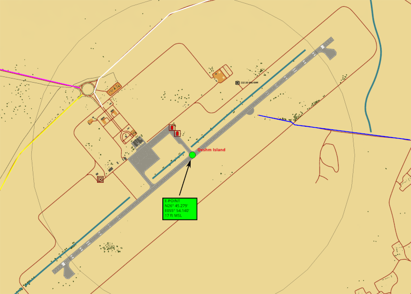
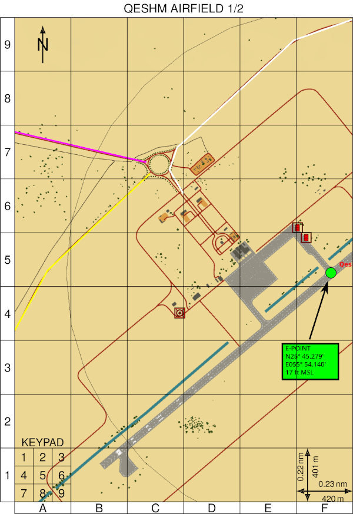
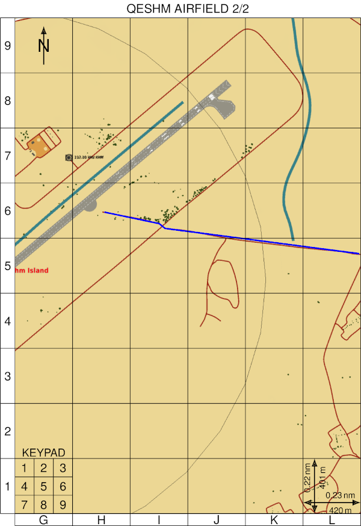
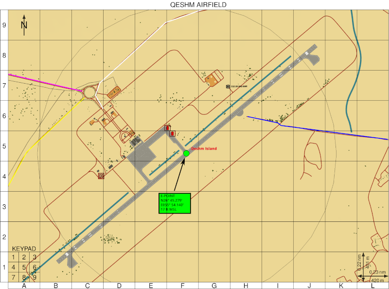

<!---
GRG-bot: provide GRGs for maps via a discord bot
Copyright © 2019 132nd.Professor

This program is free software: you can redistribute it and/or modify
it under the terms of the GNU General Public License as published by
the Free Software Foundation, either version 3 of the License, or
(at your option) any later version.

This program is distributed in the hope that it will be useful,
but WITHOUT ANY WARRANTY; without even the implied warranty of
MERCHANTABILITY or FITNESS FOR A PARTICULAR PURPOSE.  See the
GNU General Public License for more details.

You should have received a copy of the GNU General Public License
along with this program.  If not, see <https://www.gnu.org/licenses/>.
-->
GRG-bot
=======
Gridded Reference Graphics (GRG) bot

Installation
------------
Build the docker image using `build.sh`, insert the bot's token and your own user-ID into `environment` and run it using `run.sh`.

Usage
-----
In the #grg-bot discord channel, upload an image, and put `!grg` at the beginning of the caption message. The bot will then convert the image into a GRG according to your specifications, and return all files in a `.7z`-archive. You can pass further options, like `!grg title=AO SIERRA, h_pages=2`. Multiple options must be separated by a comma.

All GRGs are returned both as PNG (for your DCS kneeboard) and as PDF (for printing or use on a second monitor/device).

The options are:

* `h_pages=1|2|...`: How many horizontal GRG pages you want to split your map into. If you provide a value greater than 1, all pages will be enumerated in the title bar. Default: 1
* `join`: If you add this flag, GRG-bot will return a second archive that contains one large GRG, consisting of the joined smaller pages. Especially useful for JTACs, AWACS, printing and secondary monitors.
* `keypad=0|1|2|3|4`: Where to print the keypad template. 0 disables the keypad, 1 puts it in the lower left corner, 2 is lower right, 3 upper right and 4 upper left. Default: 1
* `north=0|1|2|3|4`: Where to print the north indicator. See `keypad`. Default: 3
* `nx=2|3|...`: number of horizontal grid elements per page of output. Default: 6
* `ny=2|3|...`: number of vertical grid elements per page of output. Default: 8
* `scale=NUMBER`: overall width of the image in nautical miles. When given, a scale will be printed in `scalecorner` with the width and height of a single grid element in nautical miles and meters. Default: 0.0
* `scalecorner=0|1|2|3|4`: Where to print the scale. See `keypad`. Default: 2
* `title=TITLE`: Adds a title above each page. Default: empty
* `v_pages=1|2|...`: Works like `h_pages`, but for vertical segments. Default: 1
* `width=NUMBER`: The width of a page of output in centimeter. Default: 10.5 (sheet of A6 paper in portrait)

Example
-------
Input image:

`!grg title = QESHM AIRFIELD, h_pages = 2, ny=9, scale=2.72, width=10, north=4, join`

 

GRG-bot will return the following (scaled down for GitHub):

 

 

 
